# 🦟 Combate à Dengue por Meio da Educação Digital

  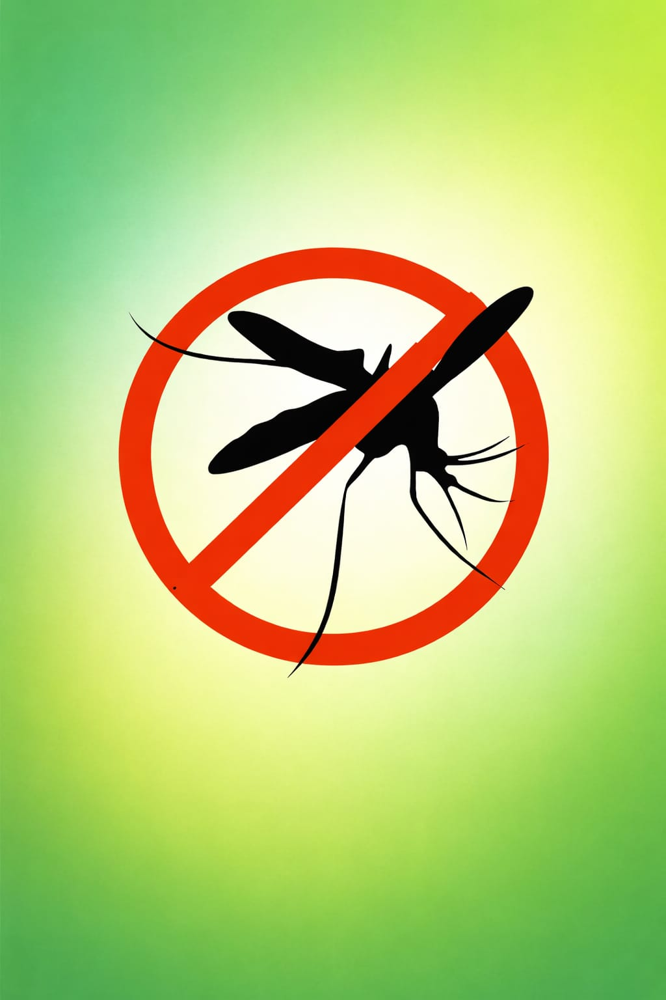

## 📖 Descrição

O projeto **Combate à Dengue por Meio da Educação Digital** foi desenvolvido como parte das Atividades Extensionistas do curso de Análise e Desenvolvimento de Sistemas da UNINTER.

O aplicativo tem como objetivo auxiliar a população da cidade de Osasco/SP na conscientização, prevenção e combate à dengue por meio da educação digital e do reporte colaborativo de possíveis focos do mosquito *Aedes aegypti*.

---

## 👨‍💻 Integrantes

- Ariel Augusto dos Santos Pacheco
- Jheniffer Lima da Silva
- Nalberto da Silva Rios

---

## 🛠 Tecnologias Utilizadas

- Thunkable
- Google Sheets
- Google Maps
- GitHub

---

## 📱 Telas do Aplicativo

### Tela Inicial
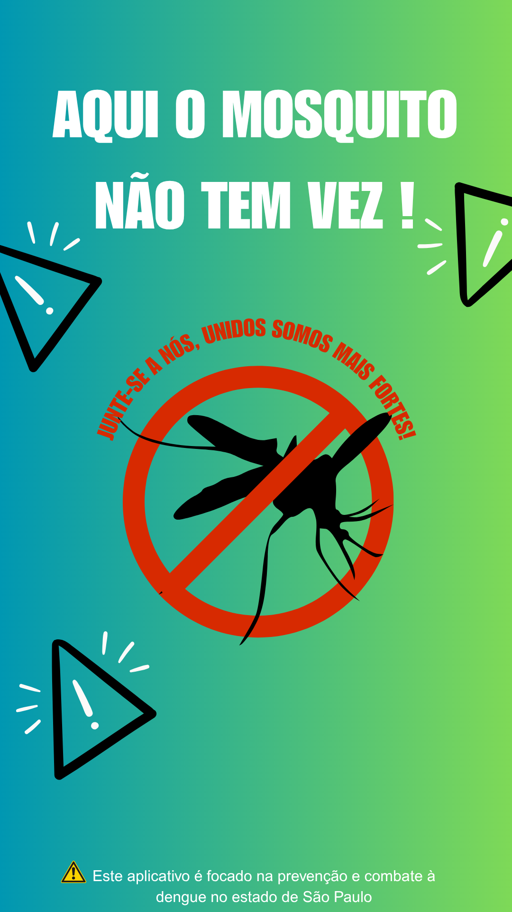

### Menu Principal
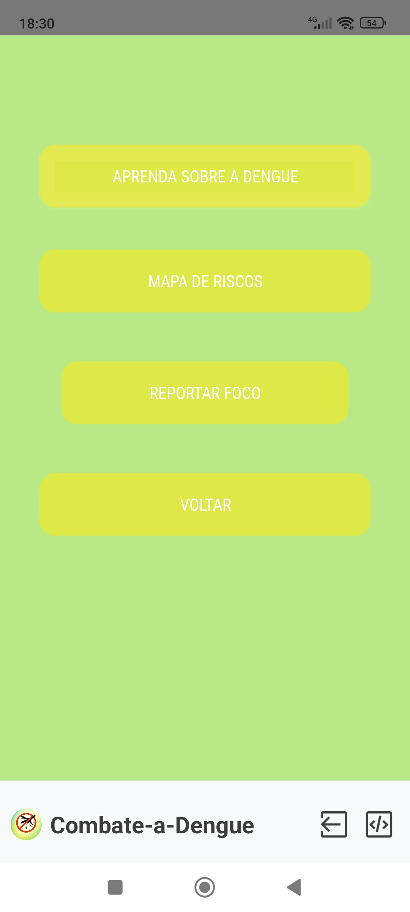

### Mapa de Reportes

### Conteúdo Educativo
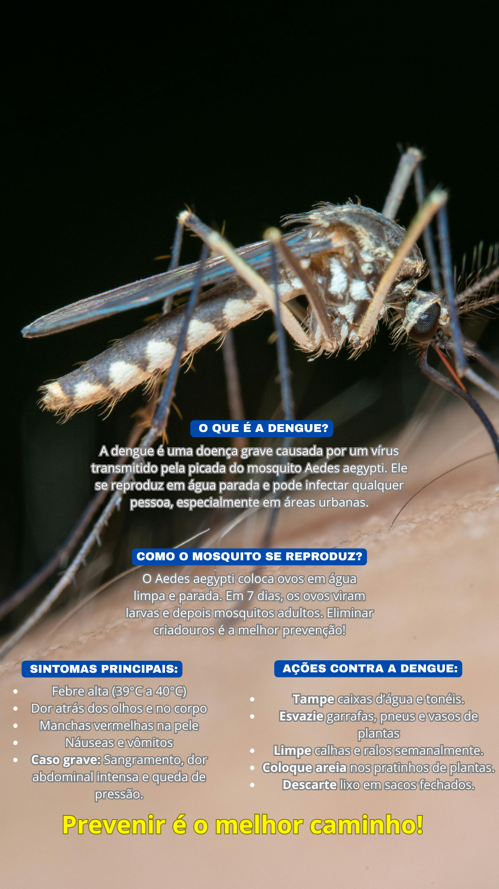

---

## 🔧 Desenvolvimento no Thunkable

### Estrutura do Aplicativo

  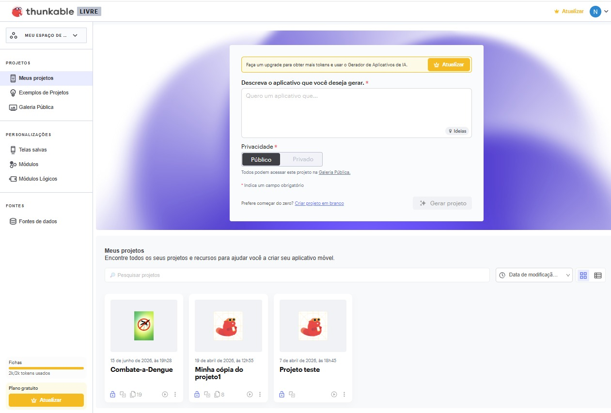
  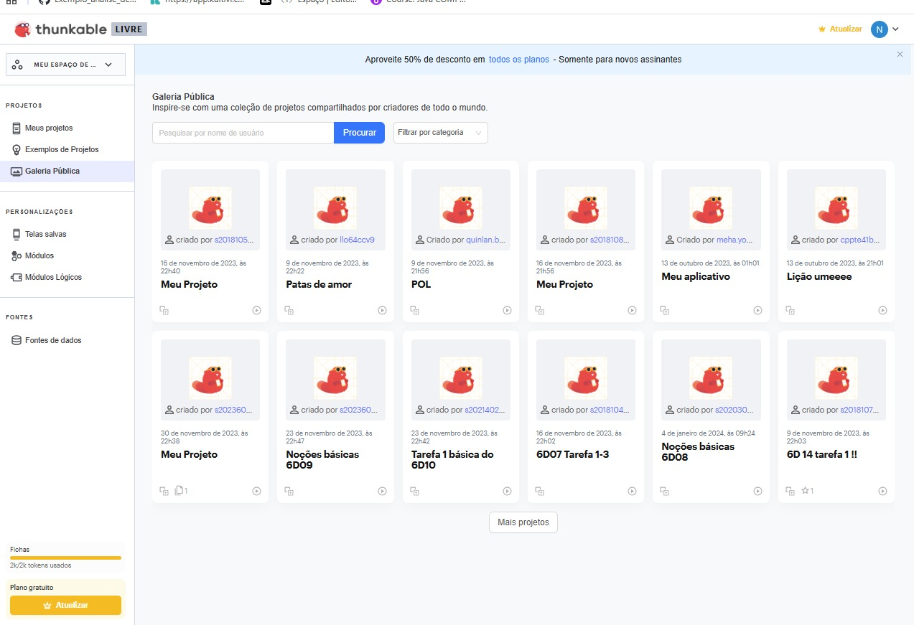
  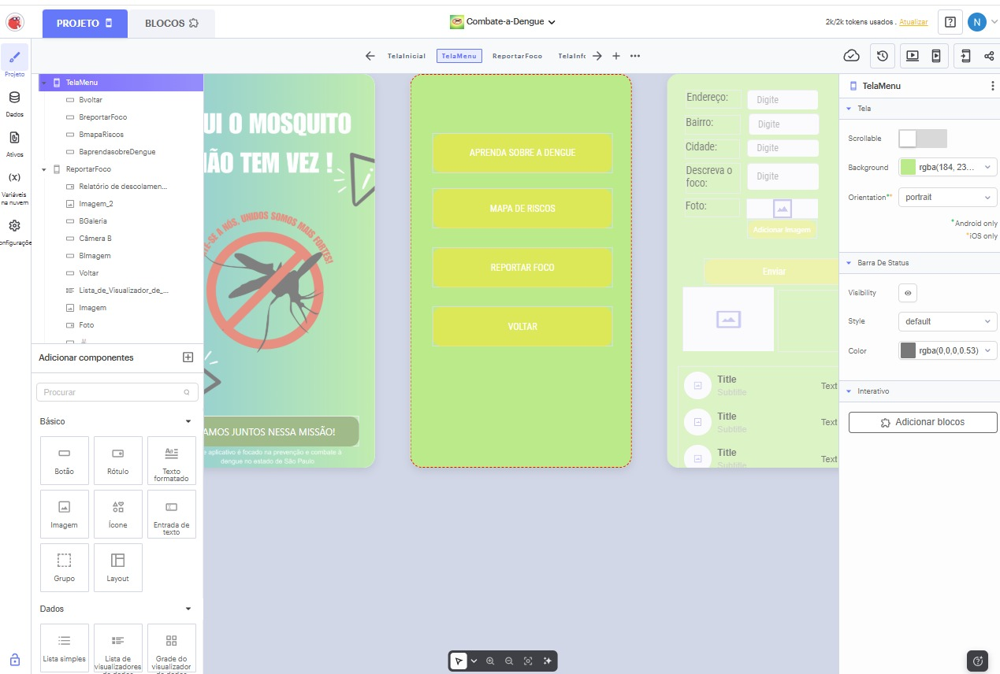

  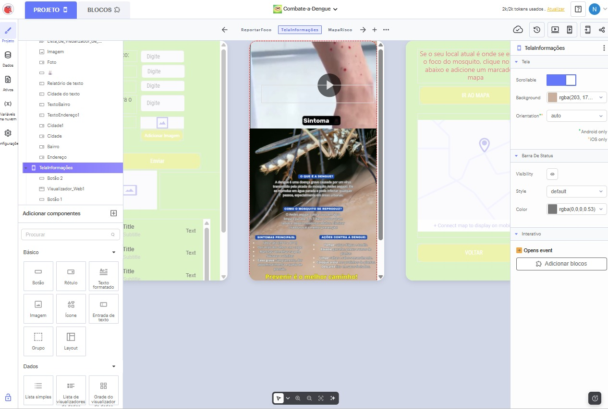
  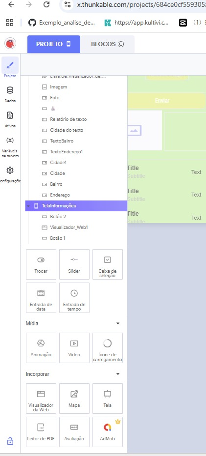
  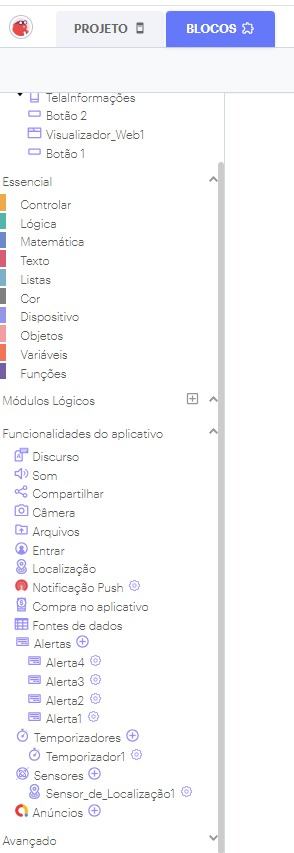

---

## 🧩 Blocos Lógicos

  

  

  

---

## 🗄 Banco de Dados

O aplicativo utiliza o Google Sheets para armazenamento dos dados enviados pelos usuários.

---

## 📸 Aplicativo em Uso

### Cadastro de Reportes
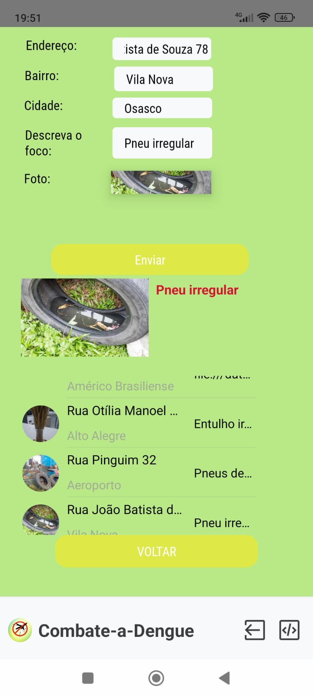

### Visualização no Mapa
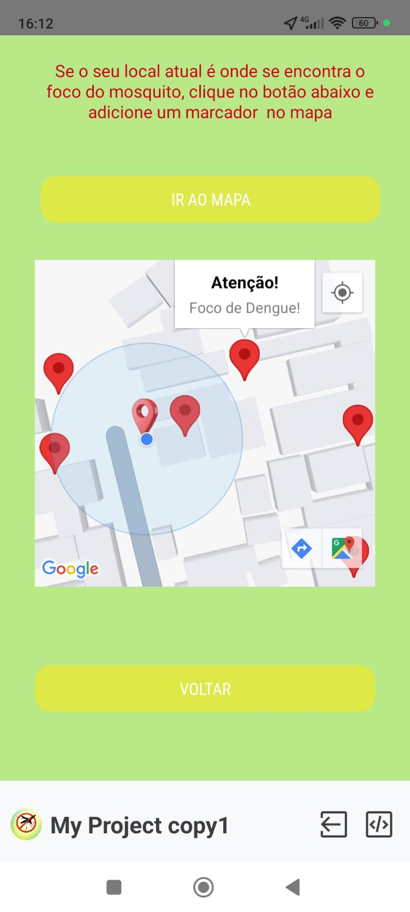

### Conteúdo Educativo
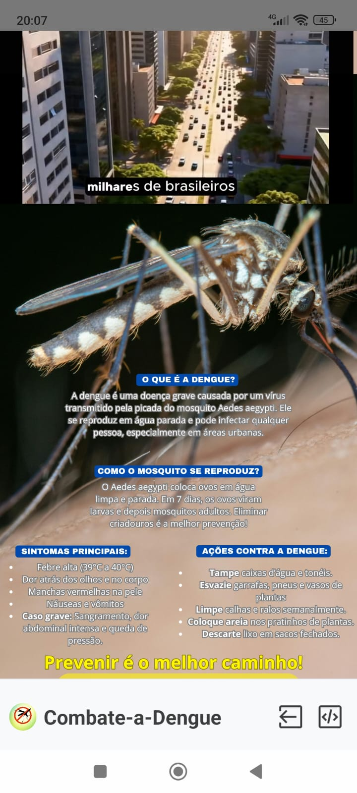

---

## 🎓 Instituição

**Centro Universitário Internacional UNINTER**  
**Curso:** Análise e Desenvolvimento de Sistemas  
**Disciplina:** Atividades Extensionistas II – Tecnologia Aplicada à Inclusão Digital